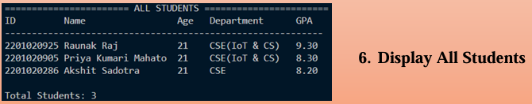

# Student Database Management System

## 📌 Introduction
The **Student Database Management System** is a C-based project designed to efficiently store, manage, and retrieve student records. It simplifies administrative tasks and ensures data integrity using structured programming principles and file handling.

## 🚀 Features
- 📂 **Add Student** - Register new students with unique IDs.
- 🔎 **Search Student** - Find student details using ID.
- ✏ **Modify Student** - Update student information.
- 🗑 **Delete Student** - Remove student records securely.
- 📜 **Display All Students** - View a formatted list of all students.
- 💾 **Data Persistence** - Uses binary file storage for saving data between executions.

## 🛠 Technologies Used
- **Programming Language**: C
- **File Handling**: Binary file operations for data storage
- **Concepts Used**: Structs, Functions, Input Validation

## 📜 Installation & Usage
1. Clone this repository:
   ```bash
   git clone https://github.com/yourusername/Student-Database-Management.git
   ```
2. Navigate to the project folder:
   ```bash
   cd Student-Database-Management
   ```
3. Compile the program:
   ```bash
   gcc student_dbms.c -o student_dbms
   ```
4. Run the executable:
   ```bash
   ./student_dbms
   ```

## 📌 How It Works
- The system operates through a **menu-driven interface**.
- **Input validation** ensures accurate student records.
- **File operations** persist data across program runs.

## **Output**
### Main Console


### Add Students


### Functionalities


### Display All Students


## 🎯 Future Improvements
- Integration with a database (MySQL or SQLite)
- GUI version using Python or Java
- Enhanced security features (authentication & encryption)

## Contributors ✨

Thanks to these amazing contributors:

- [@AkshitSadotra](https://github.com/akshit-123-lab)
- [@JoyntiMahato](https://github.com/Joynti)
- [@PriyaMahato](https://github.com/SOhniYo)
- [@RaunakRaj](https://github.com/Raunak40)

